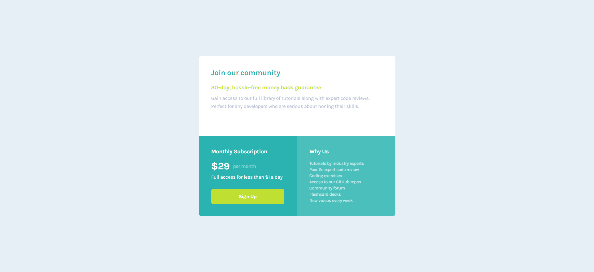

# Frontend Mentor - Single price grid component solution

This is a solution to the [Single price grid component challenge on Frontend Mentor](https://www.frontendmentor.io/challenges/single-price-grid-component-5ce41129d0ff452fec5abbbc). Frontend Mentor challenges help you improve your coding skills by building realistic projects.

## Table of contents

- [Overview](#overview)
  - [The challenge](#the-challenge)
  - [Screenshot](#screenshot)
  - [Links](#links)
- [My process](#my-process)
  - [Built with](#built-with)
  - [What I learned](#what-i-learned)
  - [Continued development](#continued-development)
  - [Useful resources](#useful-resources)
- [Author](#author)
- [Acknowledgments](#acknowledgments)

## Overview

### The challenge

Users should be able to:

- View the optimal layout for the component depending on their device's screen size
- See a hover state on desktop for the Sign Up call-to-action

### Screenshot

### Links

- Solution URL: [https://github.com/Darko96/single-price-grid-component]
- Live Site URL: [https://darko96.github.io/single-price-grid-component/]

## My process

### Built with

- Semantic HTML5 markup
- CSS custom properties
- Flexbox
- CSS Grid
- Media Queries

### What I learned

I learned how to use CSS Grid.

### Continued development

I'll definitely focus more on CSS Grid because I need a lot of practice if I want to master it.

### Useful resources

- [A Complete Guide to Grid](https://css-tricks.com/snippets/css/complete-guide-grid/) - This helped me a lot ot understand CSS Grid.

## Author

- LinkedIn - [Darko Mijatovic](https://www.linkedin.com/in/darko-mijatovic-512384231/)
- Frontend Mentor - [@Darko96](https://www.frontendmentor.io/profile/Darko96)
- Instagram - [darkomiijatovic](https://www.instagram.com/darkomiijatovic/)

## Acknowledgments

I want to thank a lot everyone in Frontend Mentor team. Because they made a awsome website where we can practice a lot easier.

Thank you so much for checking my project and Any feedback is highly appreciated.
